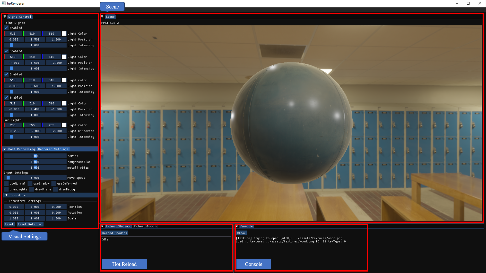
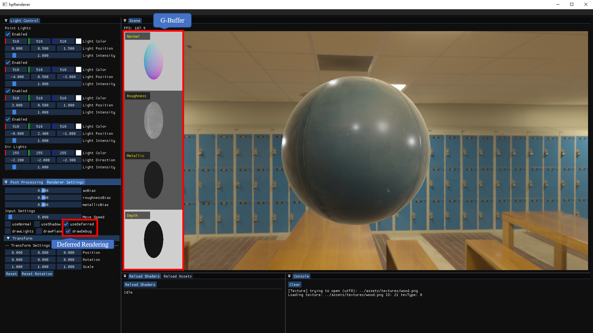
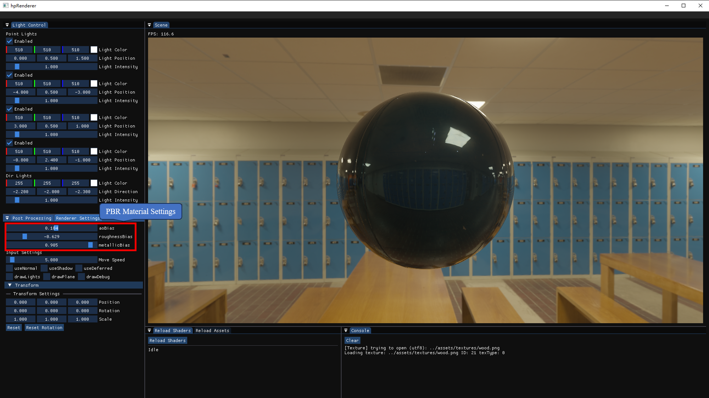
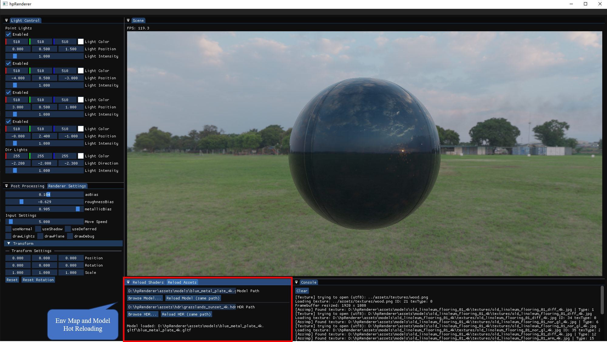
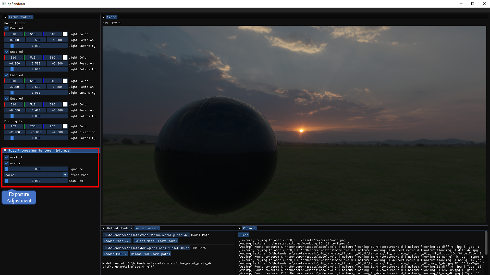

# hpRenderer

[English](./README.md) | [日本語](./README_JP.md)

A lightweight real-time renderer built with OpenGL, supporting both forward and deferred rendering pipelines.

Developed from scratch, it implements physically-based rendering (PBR), image-based lighting (IBL), and HDR lighting, with a focus on extensible rendering architecture and core techniques used in modern game engines.

---

##  Screenshots

### Main Interface
<p align="left">
  
</p>

### G-Buffer Visualization
<p align="left">
  
</p>

### PBR
<p align="left">
  
</p>

### Reload (Model/Env Map)
<p align="left">
  
</p>

### Post Processing (HDR)
<p align="left">
  
</p>
---

##  Features

### Rendering Pipeline
- Supports both Forward and Deferred rendering paths
- G-Buffer based deferred shading pipeline
- Physically Based Rendering (PBR) workflow
- Image-Based Lighting (IBL) with HDR environment maps

### Lighting & Shadows
- Directional light and multiple point lights
- Shadow mapping for directional and point lights
- Physically-based light-material interaction

### Post Processing
- Bloom effect
- Tone mapping (HDR to LDR)
- Gamma correction

### Resource & Asset System
- Model loading via Assimp (GLTF)
- Texture and environment map management
- Runtime asset reloading

### Rendering Infrastructure
- Supports multi-pass rendering (forward, deferred, post-processing)
- Framebuffer management
- Runtime shader hot-reloading

### Editor (Debug Tools)
- Real-time parameter tweaking (lighting, materials)
- Transform editing
- G-Buffer visualization
- Console output window
    
---

##  Getting Started

### Requirements

- CMake (>= 3.15)
    
- Visual Studio 2022 (Windows)
    
- OpenGL 3.3+
    

---

### Build

```bash
git clone https://github.com/kazum1-hp/hpRenderer.git
cd hpRenderer
mkdir build
cd build
cmake ..
cmake --build .
```

---

### Run

Run the executable from:

```bash
build/Debug/hpRenderer.exe
```

---

##  Project Structure

```
hpRenderer/
├── src/            # Source files
├── include/        # Header files
├── shaders/        # GLSL shaders
├── assets/         # Models / textures / HDR
├── third_party/    # External libraries
├── docs/           # Screenshots
├── CMakeLists.txt
```

---

##  Tech Stack

- **Language**: C++
- **Graphics API**: OpenGL
- **Shading**: GLSL
- **Build System**: CMake

- **Libraries**:
  - GLFW (window & input)
  - GLAD (OpenGL loader)
  - ImGui (debug UI)
  - Assimp (model loading)
  - stb_image (texture loading)
  - GLM (math library)
    

---

##  Controls

- **Camera**: Mouse + Keyboard movement 

- **Editor (ImGui)**:
  - Adjust lighting parameters
  - Modify material properties (PBR)
  - Toggle rendering modes (Forward / Deferred)
  - Reload shaders and assets at runtime
        

---

##  Highlights

- Built a complete rendering pipeline from scratch using OpenGL
    
- Implemented deferred rendering with G-buffer debugging
    
- Designed an interactive editor for real-time rendering control
    
- Integrated runtime asset and shader hot-reloading system
    

---

##  Future Works

### Rendering Pipeline Extensions
- Screen Space Ambient Occlusion (SSAO) / Screen Space Reflections (SSR)
- Order-Independent Transparency (OIT)
- Cascaded Shadow Maps (CSM) for large-scale scenes

### Performance & Optimization
- Frustum Culling and GPU-driven rendering
- Compute Shader-based optimizations (e.g. tiled/clustered shading)
- GPU profiling and performance visualization tools

### Visual Effects
- Volumetric effects (e.g. fog, clouds)
- Realistic water rendering
- Advanced post-processing pipeline

### Engine Features
- Scene serialization and asset pipeline improvements

### Exploration (Long-term)
- Hybrid rendering techniques (rasterization + ray tracing)
- Non-photorealistic rendering (NPR)
    

---

##  Acknowledgements

Some assets used in this project are sourced from [Poly Haven](https://polyhaven.com/), which provides high-quality HDRIs, textures, and 3D models under free licenses.

This project was developed with reference to publicly available resources such as [LearnOpenGL](https://learnopengl.com/), while extending and integrating the concepts into a custom rendering pipeline.
    

---

## License

This project is licensed under the MIT License.  
See the [LICENSE](./LICENSE) file for details.

This project is developed for learning and portfolio purposes.