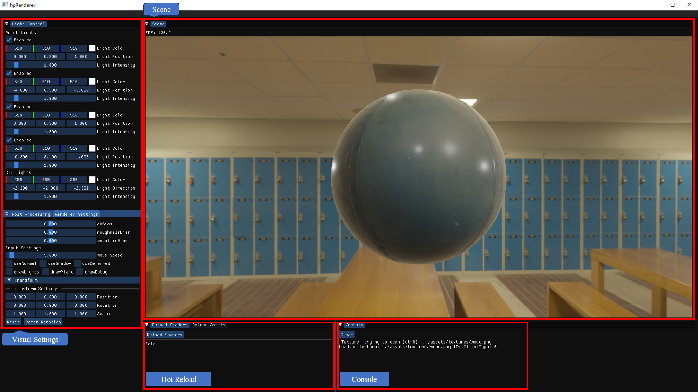
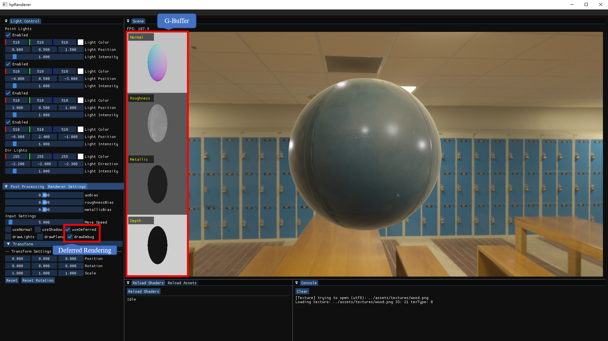
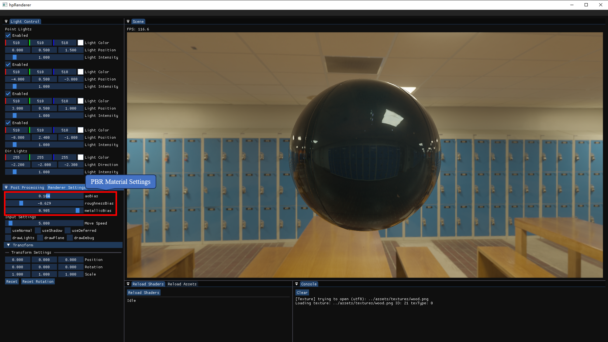
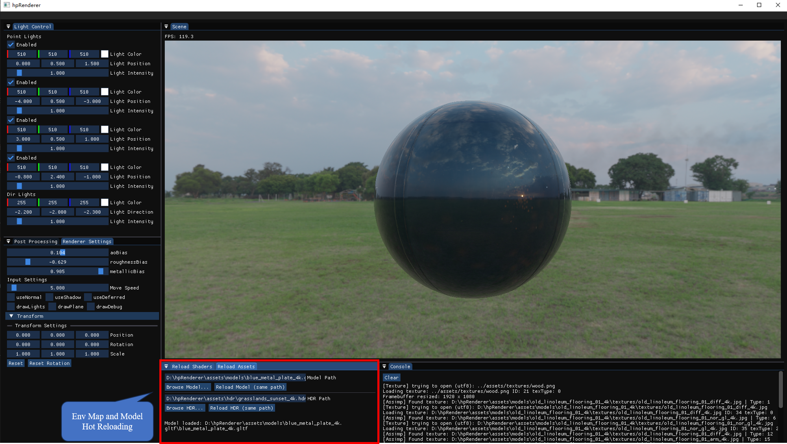
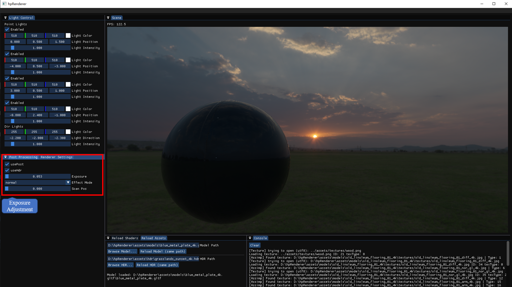
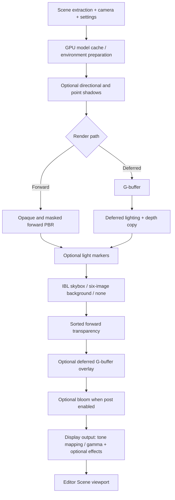

# hpRenderer

[English](./README.md) | [日本語](./README_JP.md)

A C++17 / OpenGL 3.3 real-time renderer with forward and deferred PBR, image-based
lighting, shadows, and an ImGui editor. Built as a graphics-programming portfolio
project, with explicit render passes and testable CPU/GPU boundaries.

## Build and run

The repository includes third-party source, shaders, and a complete default demo.
**No Git LFS, submodule initialization, or asset download is required.** After the
toolchain is installed, configuring and building uses local vendored dependencies.

Requirements: Windows x64, Visual Studio 2022 with **Desktop development with C++**
and a Windows SDK, CMake **3.22+**, and an OpenGL **3.3+** graphics driver.

Run in PowerShell:

```powershell
git clone --depth 1 https://github.com/kazum1-hp/hpRenderer.git
cd hpRenderer
cmake -S . -B build -G "Visual Studio 17 2022" -A x64 -DBUILD_TESTING=ON
cmake --build build --config Release --parallel 4
.\build\Release\hpRenderer.exe
```

The default demo contains a marble bust, its material textures, an HDR environment,
and optional ground-plane textures (about **9.32 MiB** of runtime assets).
All original additional models/HDRs remain in the repository. To start the original
three-model scene and bundle all listed demo assets:

```powershell
cmake -S . -B build -DHPRENDERER_FULL_DEMO=ON
cmake --build build --config Release --parallel 4
```

Use `OFF` to return to the compact demo. First compilation builds Assimp as well;
it takes longer than an incremental build. Shallow clone skips history, not current
assets: the source checkout is still larger than the compact runtime package.

Prefer a prebuilt version? See [Releases](https://github.com/kazum1-hp/hpRenderer/releases).
Extract the **whole** runtime package and open `bin/hpRenderer.exe` for packages
generated by the current build. Keep assets/shaders beside the bin directory.
Earlier releases may use a different layout.

For shader hot reload, run the development executable from the build directory,
edit files in the repository's `shaders/`, then click **Reload Shaders** in the editor.
No rebuild is needed after GLSL edits. The console prints the active shader directory
at startup. Installed/relocated packages use their own bundled `shaders/` instead.

## Screenshots

These screenshots show the earlier full demo/editor layout; the compact startup
scene and some panel controls have since changed.

### Main interface



### G-buffer visualization



### PBR



### Runtime asset loading



### HDR / exposure



## Rendering Pipeline

This diagram follows the current `RenderPipeline::render` order. IBL preparation
is cached and runs only when its inputs change.


```mermaid
flowchart TD
    Input[Scene extraction + camera + settings] --> Prepare[GPU model cache / environment preparation]
    Prepare --> Shadows[Optional directional and point shadows]
    Shadows --> Path{Render path}
    Path -->|Forward| Forward[Opaque and masked forward PBR]
    Path -->|Deferred| GBuffer[G-buffer]
    GBuffer --> Lighting[Deferred lighting + depth copy]
    Forward --> Markers[Optional light markers]
    Lighting --> Markers
    Markers --> Sky[IBL skybox / six-image background / none]
    Sky --> Transparent[Sorted forward transparency]
    Transparent --> Debug[Optional deferred G-buffer overlay]
    Debug --> Bloom[Optional bloom when post enabled]
    Bloom --> Tone[Display output: tone mapping / gamma + optional effects]
    Tone --> View[Editor Scene viewport]
```

Six-image skyboxes are **background-only**; selecting them disables IBL lighting.
Transparent materials use linear HDR forward compositing in both render paths.
Display conversion always runs; disabling post uses default Reinhard + gamma and
disables optional effects. Mesh-center transparency sorting cannot resolve
intersections. Assets are cached until shutdown; deleting an object does not unload
its cached resources. The
[architecture document](docs/architecture.md) explains pass responsibilities,
resource lifetimes, cache invalidation, and dependency direction.

## Features

- Forward and deferred PBR; imported base color, AO, roughness, metallic and normal
  textures; per-object material bias controls.
- HDR image-based lighting: environment conversion, irradiance convolution,
  prefiltered specular cubemap and BRDF LUT.
- Directional / multiple point lights, directional and cubemap shadow maps.
- Bloom, tone mapping, gamma correction and G-buffer debugging.
- Static model import: glTF/GLB, OBJ, PMX and FBX; hierarchical node transforms,
  shared mesh instances, embedded textures and Unicode file paths.
- Imported alpha masking, sorted alpha blending and two-sided materials.
- Six-image cubemap loading with explicit face order and named-face matching.
- Dockable scene, inspector, lighting, render settings, asset and console panels;
  shader/model/environment reloading with failure handling.
- CPU regression tests plus opt-in hidden-context OpenGL integration tests.

Model material values are imported, not edited through a material-slot override
system. The inspector exposes AO/roughness/metallic **bias** and normal-map use.
Skeletal animation, PMX morph/physics playback and native Blender scene loading
are not implemented. See the [Blender conversion guide](docs/blender_model_import_zh.md)
for files requiring conversion.

## Controls and a quick demo tour

Inside the Scene viewport:

- **W/A/S/D**: move; **Q/E**: up/down; **mouse**: look; **scroll**: field of view.
- **Left Alt (hold)**: release the cursor for editor interaction.
- **Space**: reset camera; **1/2**: toggle directional/point lighting; **Esc**: exit.
- Text entry captures keyboard input so typing does not move the camera.

Try switching Forward/Deferred, enabling the ground plane and shadows, inspecting
the G-buffer, and adjusting exposure/bloom. Compare the same scene in both paths.
Reload Assets accepts your own models/HDRs; keep private downloads in
`assets/local/` (ignored by Git and excluded from release packaging).

## Tests and standalone packages

```powershell
ctest --test-dir build -C Release --output-on-failure

# Optional, on a machine with a working OpenGL 3.3 driver:
cmake -S . -B build -DHPRENDERER_GPU_TESTS=ON
cmake --build build --config Release --parallel 4
ctest --test-dir build -C Release --output-on-failure

# Build a self-contained runtime ZIP from the Release build:
cpack --config build/CPackConfig.cmake -C Release -B dist
```

Output: `dist/hpRenderer-windows-x64.zip`, including the executable, required
assets/shaders, MSVC runtime DLLs, documentation and dependency notices. Packaging
uses an explicit asset allowlist, not whatever happens to exist in a developer's
build directory. See [staging and validation](docs/repository.md).

[Windows CI](.github/workflows/windows.yml) builds Debug and Release, runs CPU
tests, validates installed startup assets and uploads a runnable ZIP artifact.
GPU tests compile in CI but are not run on standard hosted runners; CI does not
replace [manual visual checks](docs/refactor_baseline.md).
The workflow does not automatically publish a GitHub Release.

## Project Structure

```text
src/
├── app/                 Application and startup
├── core/                Window, input, runtime paths
├── assets/              CPU import / decoding and asset cache
├── scene/               Scene, transforms, lights, material bias
├── renderer/
│   ├── passes/          Concrete rendering passes
│   ├── ibl/             IBL precomputation and cache
│   └── opengl/          GL resource wrappers
└── editor/              Editor layer, panels and console
include/hpr/             Public headers grouped by module
shaders/                 GLSL
assets/                  Complete demos; local/ is private/ignored
third_party/             Vendored dependencies and notices
tests/                   CPU and opt-in GPU regressions
cmake/                   Runtime asset manifests and packaging
docs/                    Architecture, guides and screenshots
.github/workflows/       Windows build/test/package checks
```

The CPU importer links neither OpenGL nor ImGui. The runtime has no editor
dependency. `AssetManager` is explicitly Application-owned; GL textures/shaders
still live in its cache, so the entire asset service is not yet CPU-only.
There is deliberately no speculative cross-API RHI.

## Recent Updates

- Split renderer/editor responsibilities and introduced named render targets and
  independent shadow, forward, G-buffer, lighting, skybox and post-process passes.
- Separated CPU model/image import from GPU upload and added revision-aware model
  and IBL caches; replaced the global resource singleton.
- Preserved Assimp node hierarchy, added static PMX/FBX import, Unicode paths,
  embedded images and imported alpha/two-sided material behavior.
- Restored imported materials with per-object bias controls; isolated editor input
  capture and added six-image skybox face matching/orientation regression tests.
- Added a complete compact default demo, explicit packaging manifests, executable-
  relative startup paths, Windows CI, and standalone ZIP packaging.
- Added architecture/dependency documentation and a project `.clang-format`;
  retained vendored dependencies and all existing assets for reproducible builds.

## Next Steps

Priorities: asset provenance metadata, scene serialization/stable IDs, visual
smoke automation, profiling and frustum culling. Later rendering experiments may
include SSAO/SSR, cascaded shadows, OIT or NPR. Animation and additional graphics
backends are future work, not current features.

## Acknowledgements and License

Built with GLFW, GLAD, Dear ImGui, ImGuiFileDialog, Assimp, GLM and stb_image;
see [versions, local patches and notices](third_party/README.md).

Developed with reference to [LearnOpenGL](https://learnopengl.com/), extending the
techniques into a custom rendering pipeline. Some existing demo assets are from
[Poly Haven](https://polyhaven.com/). Individual asset provenance still needs a
complete inventory; see the [asset policy](docs/repository.md).

Project code is [MIT licensed](LICENSE). Third-party libraries and artwork retain
their own licenses; the project's MIT license does not relicense downloaded models.
