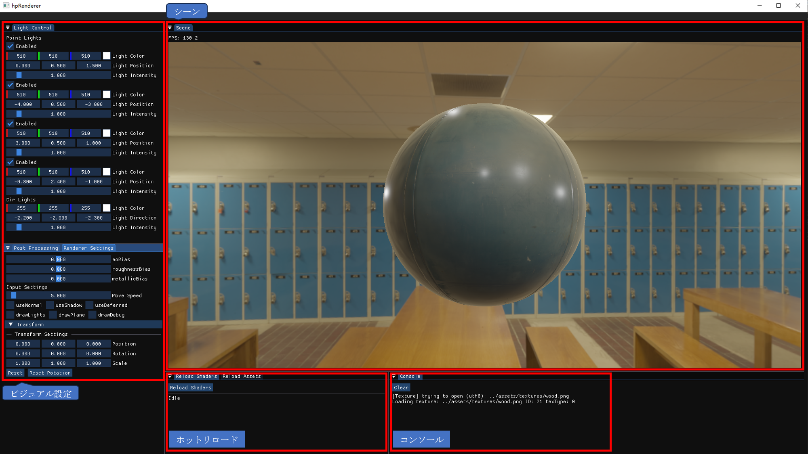
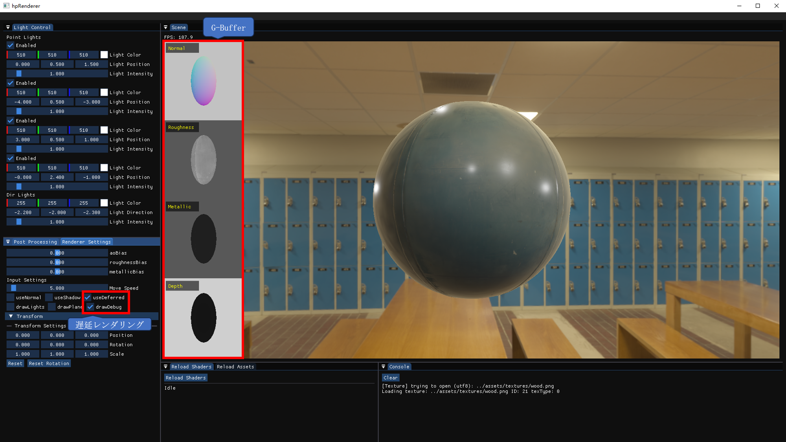
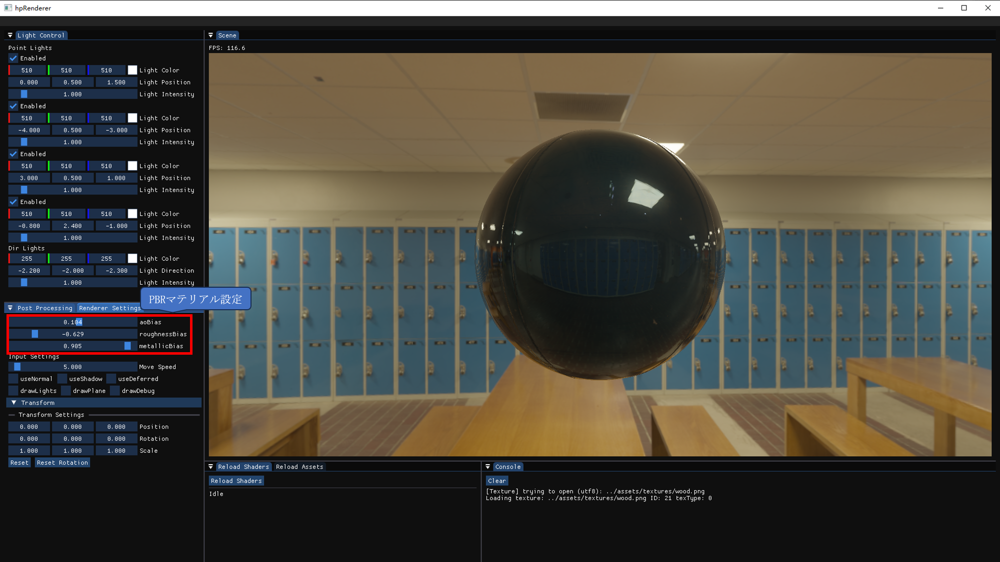
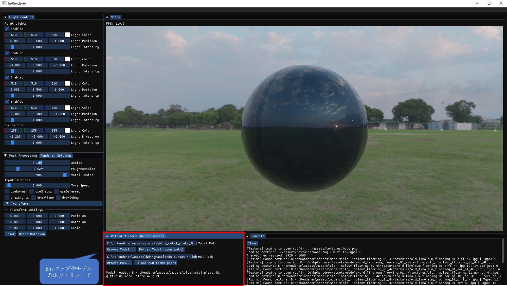
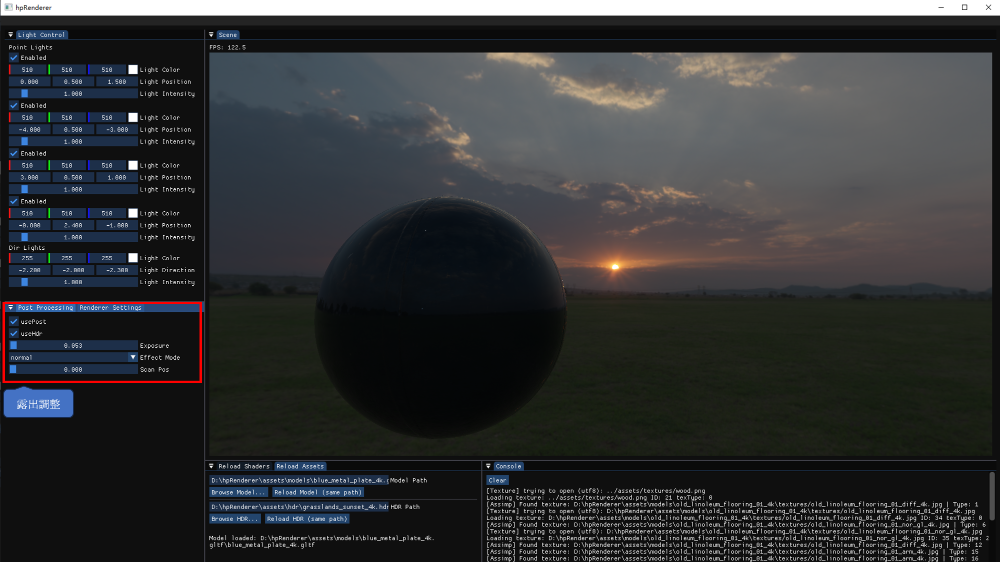

# hpRenderer

OpenGL を用いて開発した軽量なリアルタイムレンダラーです。フォワードレンダリングおよびディファードレンダリングの両方に対応しています。

本プロジェクトはゼロから実装しており、PBR（物理ベースレンダリング）、IBL（Image-Based Lighting）、HDR ライティングなど、現代のゲームエンジンで用いられるコア技術を中心に、拡張性のあるレンダリングアーキテクチャを構築しています。

---

## スクリーンショット

### メイン画面
<p align="left">
  
</p>

### G-Buffer 可視化
<p align="left">
  
</p>

### PBR
<p align="left">
  
</p>

### リロード（モデル / 環境マップ）
<p align="left">
  
</p>

### ポストプロセス（HDR）
<p align="left">
  
</p>

---

## 主な機能

### レンダリングパイプライン
- フォワードレンダリングとディファードレンダリングの両対応
- G-Buffer を用いたディファードシェーディング
- PBR（Physically Based Rendering）ワークフロー
- HDR 環境マップによる IBL（Image-Based Lighting）

### ライティング & シャドウ
- 平行光源（Directional Light）および複数の点光源
- シャドウマッピング（Directional / Point Light）
- 物理ベースのマテリアル・ライティング相互作用

### ポストプロセス
- Bloom（ブルーム）効果
- トーンマッピング（HDR → LDR）
- ガンマ補正

### リソース管理
- Assimp によるモデル読み込み（GLTF 対応）
- テクスチャおよび環境マップ管理
- 実行時アセットのリロード

### レンダリング基盤
- マルチパスレンダリング（Forward / Deferred / PostProcess）
- フレームバッファ管理
- シェーダーのホットリロード対応

### エディタ（デバッグツール）
- ライティング・マテリアルのリアルタイム調整
- Transform 編集
- G-Buffer の可視化
- コンソール出力ウィンドウ

---

## セットアップ

### 必要環境

- CMake（3.15 以上）
- Visual Studio 2022（Windows）
- OpenGL 3.3 以上

---

### ビルド手順

```bash
git clone https://github.com/kazum1-hp/hpRenderer.git
cd hpRenderer
mkdir build
cd build
cmake ..
cmake --build .
```

---

### 実行方法

```bash
build/Debug/hpRenderer.exe
```

---

## ディレクトリ構成

```
hpRenderer/
├── src/            # ソースコード
├── include/        # ヘッダファイル
├── shaders/        # GLSL シェーダー
├── assets/         # モデル / テクスチャ / HDR
├── third_party/    # 外部ライブラリ
├── docs/           # スクリーンショット
├── CMakeLists.txt
```

---

## 技術スタック

- **言語**: C++
- **グラフィックス API**: OpenGL
- **シェーディング**: GLSL
- **ビルドシステム**: CMake

- **使用ライブラリ**:
  - GLFW（ウィンドウ管理・入力）
  - GLAD（OpenGL ローダー）
  - ImGui（デバッグ UI）
  - Assimp（モデル読み込み）
  - stb_image（テクスチャ読み込み）
  - GLM（数値計算ライブラリ）

---

## 操作方法

- **カメラ操作**: マウス + キーボード

- **エディタ（ImGui）**:
  - ライティングパラメータの調整
  - マテリアル（PBR）の編集
  - レンダリングモード切替（Forward / Deferred）
  - シェーダー・アセットのリロード

---

## 技術的なポイント

- OpenGL を用いてレンダリングパイプラインをゼロから構築
- G-Buffer を活用したディファードレンダリングの実装と可視化
- リアルタイムで調整可能なインタラクティブエディタの設計
- アセットおよびシェーダーのホットリロード機構の実装

---

## 今後の展望

### レンダリング拡張
- SSAO / SSR
- OIT（Order-Independent Transparency）
- CSM（Cascaded Shadow Maps）

### パフォーマンス最適化
- フラスタムカリング
- GPU 駆動レンダリング
- Compute Shader を用いた最適化
- GPU プロファイリング

### ビジュアル表現
- ボリューム表現（霧・雲）
- 水面レンダリング
- 高度なポストプロセス

### エンジン機能
- シーンシリアライズ
- アセットパイプライン改善

### 長期的な研究
- ハイブリッドレンダリング（ラスタライズ + レイトレーシング）
- NPR（Non-Photorealistic Rendering）

---

## ライセンス

本プロジェクトは MIT License の下で公開されています。  
詳細は LICENSE ファイルをご参照ください。

本プロジェクトは学習およびポートフォリオ目的で開発されています。
