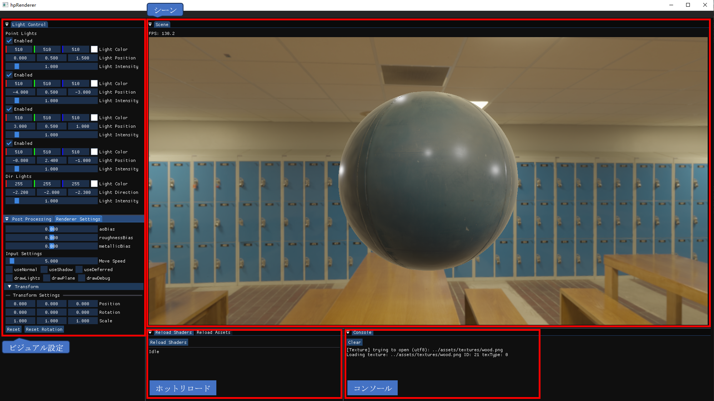
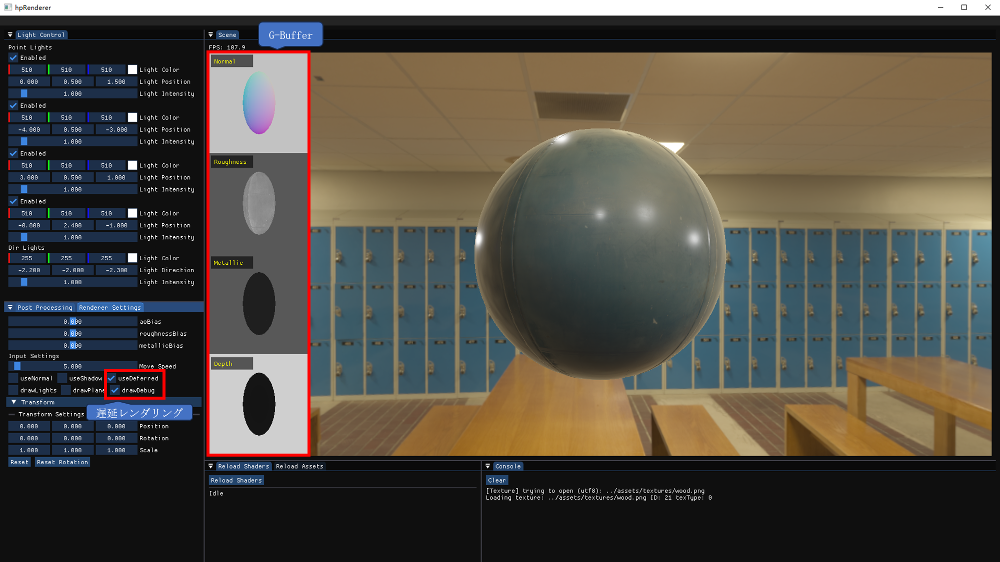
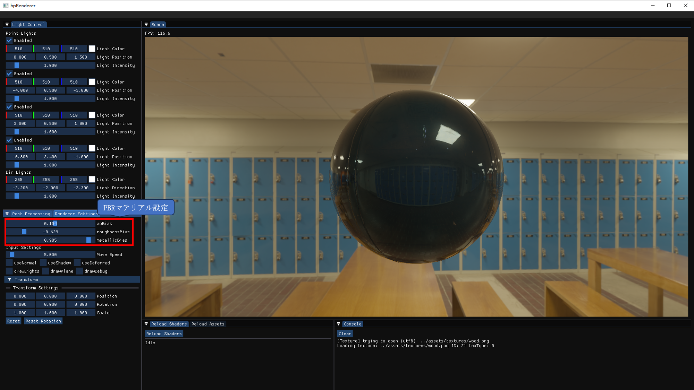
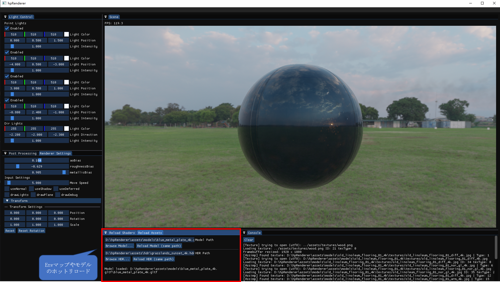
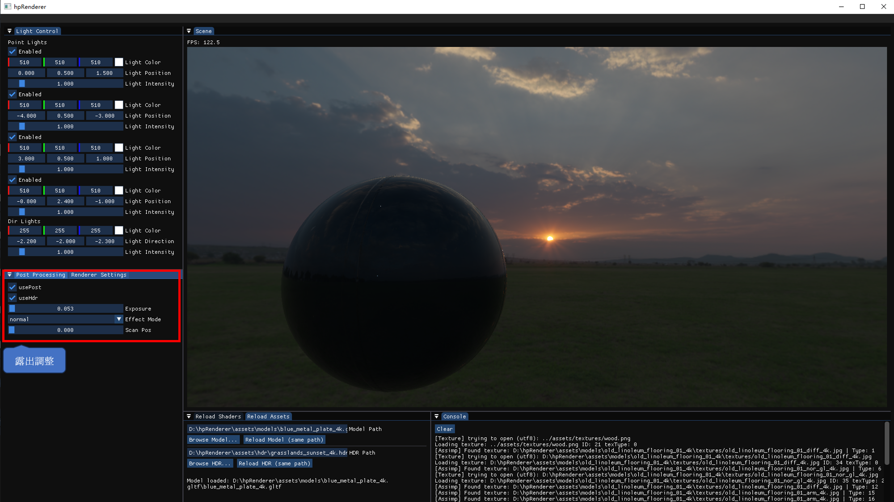
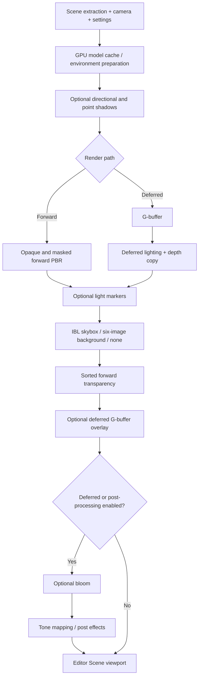

# hpRenderer

[English](./README.md) | [日本語](./README_JP.md)

C++17 / OpenGL 3.3 で開発しているリアルタイムレンダラーです。
フォワード／ディファード PBR、IBL、シャドウ、ImGui エディターを実装しています。
グラフィックスプログラミングのポートフォリオとして、描画処理の実装と、
CPU／GPU の責務分離・検証可能な構造を重視しています。

## ビルドと起動

第三者ライブラリのソース、シェーダー、起動に必要なデモ素材を同梱しています。
**Git LFS、submodule の初期化、別途の素材ダウンロードは不要です。**
ツールチェーンのインストール後は、依存ライブラリをダウンロードせずに構築できます。

必要環境：Windows x64、Visual Studio 2022 の「C++ によるデスクトップ開発」と
Windows SDK、**CMake 3.22 以上**、**OpenGL 3.3 以上**に対応する GPU ドライバー。

PowerShell で実行してください。

```powershell
git clone --depth 1 https://github.com/kazum1-hp/hpRenderer.git
cd hpRenderer
cmake -S . -B build -G "Visual Studio 17 2022" -A x64 -DBUILD_TESTING=ON
cmake --build build --config Release --parallel 4
.\build\Release\hpRenderer.exe
```

標準デモは胸像モデル、マテリアル画像、HDR 環境、任意表示の地面用テクスチャを
使用します。実行に必要な素材は合計約 **9.32 MiB** です。描画機能は削減していません。
従来の追加モデル／HDR もリポジトリに残しています。従来の 3 モデルのシーンで
起動し、追加デモ素材もビルド先／配布パッケージに含めるには：

```powershell
cmake -S . -B build -DHPRENDERER_FULL_DEMO=ON
cmake --build build --config Release --parallel 4
```

軽量デモに戻す場合は `OFF` を指定します。初回は Assimp などもビルドするため、
差分ビルドより時間がかかります。浅い clone は履歴の取得を省くだけで、現行の
大容量素材を省略するものではありません。

ビルド済み版は [Releases](https://github.com/kazum1-hp/hpRenderer/releases) を
参照してください。現行 CMake で作成した ZIP は**全体を展開**してから
`bin/hpRenderer.exe` を起動します。assets と shaders は bin と同じ階層に必要です。
過去の Release は配置が異なる場合があります。

## スクリーンショット

以下は以前のフルデモ／UI の画面です。現在の標準起動シーンと一部の操作項目は
更新されています。

### メイン画面



### G-buffer 可視化



### PBR



### モデル／環境のリロード



### HDR／露出



## Rendering Pipeline

現在の `RenderPipeline::render` に対応する図です。IBL の事前計算はキャッシュされ、
入力が変わった場合に行われます。


```mermaid
flowchart TD
    Input[Scene extraction + camera + settings] --> Prepare[GPU model cache / environment preparation]
    Prepare --> Shadows[Optional directional and point shadows]
    Shadows --> Path{Render path}
    Path -->|Forward| Forward[Opaque and masked forward PBR]
    Path -->|Deferred| GBuffer[G-buffer]
    GBuffer --> Lighting[Deferred lighting + depth copy]
    Forward --> Markers[Optional light markers]
    Lighting --> Markers
    Markers --> Sky[IBL skybox / six-image background / none]
    Sky --> Transparent[Sorted forward transparency]
    Transparent --> Debug[Optional deferred G-buffer overlay]
    Debug --> Post{Deferred or post-processing enabled?}
    Post -->|Yes| Bloom[Optional bloom]
    Bloom --> Tone[Tone mapping / post effects]
    Tone --> View[Editor Scene viewport]
    Post -->|No| View
```

透明物体は両経路ともスカイボックスの後にフォワード描画します。
6 枚画像のスカイボックスは**背景のみ**で、選択すると IBL ライティングを無効化します。
パス順序・所有権・依存方向の詳細は [architecture.md](docs/architecture.md) にまとめています。

## 実装済み機能

- フォワード／ディファード PBR、モデル由来のマテリアルとオブジェクト単位の bias。
- HDR 環境変換、irradiance、prefilter、BRDF LUT による IBL。
- 平行光源／複数点光源、平行光源と点光源のシャドウマップ。
- Bloom、トーンマッピング、ガンマ補正、G-buffer デバッグ表示。
- glTF/GLB、OBJ、PMX、FBX の静的モデル読み込み、親子ノード変換、
  メッシュ共有、埋め込みテクスチャ、Unicode パス。
- Alpha mask、ソートした alpha blend、両面マテリアル。
- 6 枚画像の cubemap、明示的な面順序とファイル名による面の対応付け。
- Scene／Inspector／Lighting／Render Settings／Assets／Console パネル。
- シェーダー、モデル、環境の実行時リロードとエラー処理。
- CPU 回帰テストと、任意で実行する非表示 GL コンテキストの統合テスト。

マテリアルの基本値はモデルから読み込みます。エディターで操作できるのは
AO／roughness／metallic の **bias** と法線マップの有効化で、材質スロットの
上書き編集ではありません。骨格アニメーション、PMX モーフ／物理、Blender
シーンの直接読み込みは未実装です。[Blender 変換ガイド（中国語）](docs/blender_model_import_zh.md)
も参照してください。

## 操作

Scene ビューポート内で操作します。テキスト編集中はカメラ／ライト操作を抑制します。

- **W/A/S/D**：移動、**Q/E**：上下移動、**マウス**：視点回転、**ホイール**：画角。
- **左 Alt を押している間**：マウスカーソルでエディターを操作。
- **Space**：カメラをリセット、**1/2**：平行光源／点光源を切り替え、**Esc**：終了。

Forward／Deferred を切り替え、地面とシャドウ、G-buffer、露出や Bloom を比較できます。
個人でダウンロードした素材は `assets/local/` に置くと Git と配布対象から除外されます。

## テストと配布パッケージ

```powershell
ctest --test-dir build -C Release --output-on-failure

# OpenGL 3.3 が動作するローカル環境で GPU テストを追加：
cmake -S . -B build -DHPRENDERER_GPU_TESTS=ON
cmake --build build --config Release --parallel 4
ctest --test-dir build -C Release --output-on-failure

# Release ビルドから実行用 ZIP を作成：
cpack --config build/CPackConfig.cmake -C Release -B dist
```

出力は `dist/hpRenderer-windows-x64.zip` です。exe、必須素材、シェーダー、
MSVC ランタイム DLL、ドキュメント、第三者ライセンスを含みます。
[Windows CI](.github/workflows/windows.yml) は Debug／Release をビルドし、
CPU テストと配置後の素材検証を実行して ZIP artifact を生成します。
GPU テストはコンパイルのみで、標準 hosted runner では実行しません。
GitHub Release の公開も自動化していません。

[手動の描画／操作チェック](docs/refactor_baseline.md) と
[配布・依存管理方針（中国語）](docs/repository.md) も参照してください。

## 構成と設計

```text
src/app/                 起動と Application
src/core/                Window、入力、実行時パス
src/assets/              CPU インポート／画像デコード、アセットキャッシュ
src/scene/               シーン、Transform、Light、材質 bias
src/renderer/passes/     各描画パス
src/renderer/ibl/        IBL 事前計算とキャッシュ
src/renderer/opengl/     OpenGL リソース
src/editor/             エディターレイヤー、パネル、コンソール
include/hpr/            モジュール別ヘッダー
shaders/                GLSL
assets/                 完全なデモ素材
third_party/            同梱依存ライブラリ
tests/                  CPU／GPU 回帰テスト
cmake/                  素材リスト、インストール／ZIP
docs/                   設計、ガイド、画面
.github/workflows/      Windows CI
```

CPU インポーターは OpenGL／ImGui に依存せず、ランタイムもエディターには依存しません。
AssetManager は Application が明示的に所有します。ただし GL テクスチャと
シェーダーのキャッシュも保持しているため、サービス全体が CPU 専用というわけでは
ありません。複数 API 向けの RHI は現段階では導入していません。

## Recent Updates

- Renderer と Editor を分離し、独立パスと名前付き RenderTargets を導入。
- CPU データと GPU upload を分離し、モデル／IBL の revision 対応キャッシュを追加。
- グローバル singleton を廃止し、ノード変換、静的 PMX／FBX、Unicode、
  埋め込み画像、透明／両面マテリアルに対応。
- 材質をモデル由来＋bias に整理し、入力捕捉と 6 面スカイボックスの対応付けを修正。
- 自包含の軽量デモ、実行ファイル基準のパス、明示的な配布素材リスト、Windows CI、
  ZIP パッケージと起動素材検証を追加。
- 設計／依存関係の文書と `.clang-format` を追加。従来の素材と依存ソースは保持。

## 今後の方針

まず素材の出典管理、シーン保存と安定した ID、自動描画 smoke test、プロファイリング、
フラスタムカリングを進めます。SSAO／SSR、CSM、OIT、NPR などは将来の実験候補です。
アニメーションや別の描画 API は現在の機能には含まれません。

## 謝辞とライセンス

GLFW、GLAD、Dear ImGui、ImGuiFileDialog、Assimp、GLM、stb_image を使用しています。
[依存バージョン・ローカル修正・ライセンス](third_party/README.md) を参照してください。

[LearnOpenGL](https://learnopengl.com/) の公開資料を参考に、独自の描画パイプラインとして
設計・実装しています。一部素材の入手元は [Poly Haven](https://polyhaven.com/) です。
素材ごとの出典一覧は今後補完が必要です。

プロジェクトのコードは [MIT License](LICENSE) です。外部ライブラリやモデル／画像は
各権利者のライセンスに従い、この MIT License で一括して再許諾されるものではありません。
