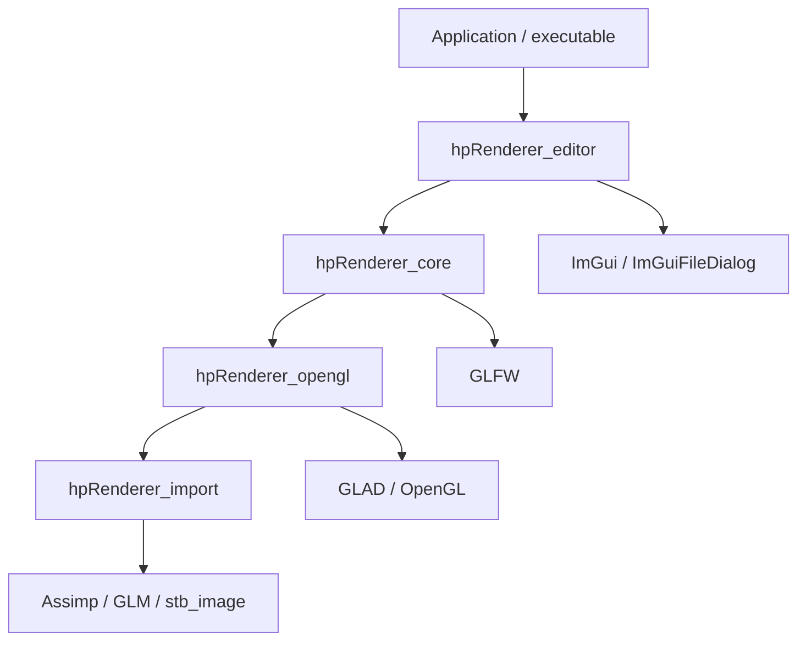
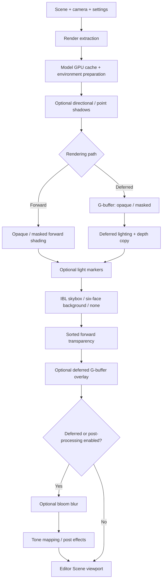

# Current architecture

This describes the current implementation, not a proposed Vulkan-style RHI.
The [stage-by-stage record](refactor_baseline.md) contains historical names.

## Module dependencies

Arrows below mean **depends on**. CMake enforces these target boundaries.

- `app/`: creates services, chooses the initial scene, drives update/render/editor,
  and defines shutdown order. The executable resolves its own directory before
  opening relative shader/asset paths.
- `assets/`: `AssimpModelImporter` produces owned CPU `ModelAsset` data;
  `ImageData` decodes pixels without GL. `Model` retains data and a revision.
  Node hierarchy/transforms, mesh instancing, material factors and image references
  survive import. Animation playback is not implemented.
- `scene/`: objects, transforms, lights and CPU asset references. There are no
  ImGui widgets or raw cubemap ownership in scene data.
- `renderer/`: extracts `RenderScene`, uploads/caches models, manages IBL,
  render targets and concrete passes. `Renderer::render` receives scene/camera/
  settings/frame inputs and returns a texture view; it stores no Scene or Window.
- `renderer/opengl/`: concrete GL mesh/texture/shader/framebuffer/skybox wrappers.
- `editor/`: panels, file dialogs, console capture and ImGui lifecycle. Editor
  capture state is explicitly passed to input; the Scene viewport allows camera
  and light shortcuts while text fields suppress them.

`AssetManager` is Application-owned, not a singleton. It still caches GL textures
and shaders as well as CPU models; **it is not yet a wholly CPU-only asset service**.
`hpRenderer_import` is the genuinely GL-free boundary. Texture keys include the
normalized filesystem path, semantic and color space. Shaders use `ShaderId`.

## Per-frame pipeline

The order follows `RenderPipeline::render`. Transparent materials are composited
after the skybox in **both** paths, using opaque depth and no transparent depth
writes. The deferred branch forces post-processing in Application. With post
disabled, the forward path returns its scene target directly. The returned
`RenderOutput` is a non-owning view, not a transferable texture allocation.

IBL precompute runs on demand, not as an unconditional per-frame pass. It generates
the environment cubemap, irradiance map, prefiltered map and BRDF LUT. Selecting
six images supplies a background cubemap only and disables IBL illumination; it
does not secretly bake six-image lighting. Faces use `+X -X +Y -Y +Z -Z`, decoded
without vertical flipping. Named-face matching is explicit in the asset panel.

## Ownership and lifetime

| Owner | Resources | Validity / invalidation |
| --- | --- | --- |
| Application / Window | Current GLFW GL context | Must outlive every GPU owner |
| Scene / Model | CPU objects, material bias, imported data, environment selection | Independent of ImGui and GL handles |
| AssetManager | CPU model cache, GL texture/shader caches | Clear after render/editor borrowers |
| ModelGpuCache (pipeline) | Uploaded models/meshes | Weak CPU model identity + model revision; expired entries removed |
| IBLCache (renderer) | Baked environment resources | Source identity/revision and bake shader programs; expired entries removed |
| RenderTargets (pipeline) | HDR, G-buffer, lighting, final, bloom and shadow targets | Viewport resize reallocates viewport targets; shadows have separate sizes |
| EditorLayer | ImGui context/backends, panel state | Shutdown before GL context destruction |

Normal shutdown is explicit: **Editor → Renderer → Scene.Clear → AssetManager.Clear
→ Window/context**. Member declaration order also keeps the Window alive during
constructor unwinding. GPU wrappers release their handles while a context exists.
Failed asset reloads preserve previous usable data; framebuffer resize failure
preserves the old valid extent. Do not retain `RenderOutput` across resize/shutdown.

Imported PBR factors/textures remain the default material. Per-object controls are
AO, roughness and metallic **bias**, plus normal-map enable/disable; there is no
Phong material system or editable material-slot override layer.

## Remaining boundaries worth improving

1. Separate CPU asset catalog and GL texture/shader cache when another consumer
   actually needs it; retain the small `TextureLoader` boundary meanwhile.
2. Replace the simple executable-relative working directory convention with an
   explicit asset root if command-line scene paths or multiple projects are added.
3. Add scene serialization, stable entity IDs and asset provenance metadata before
   a large editor expansion; keep save/load independent of GPU state.
4. Profile, then add visibility culling and measured optimizations. A render graph,
   cross-API RHI, skeletal animation and asynchronous upload are not implemented.

See [repository/build policy](repository.md) and the existing
[manual smoke matrix](refactor_baseline.md) for verification.
